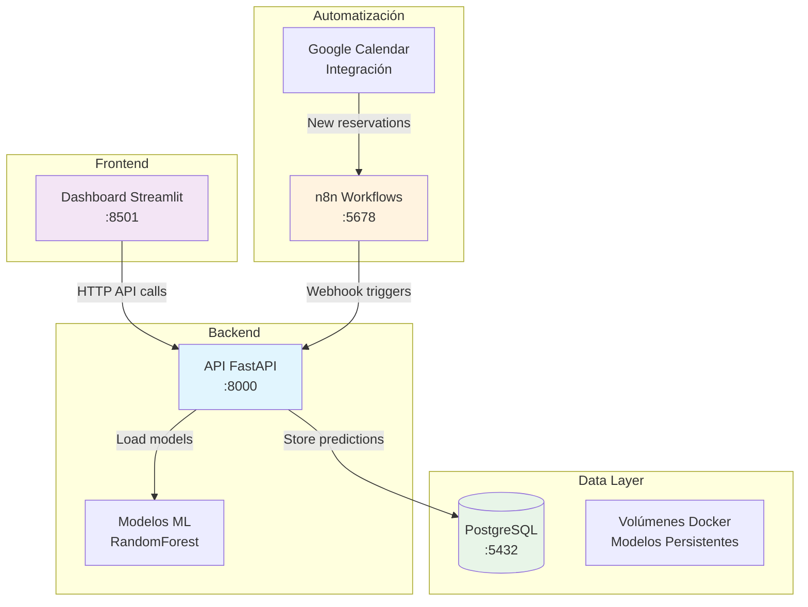

# 🍽️ MIDAS — Sistema de Predicción para Restaurante
## 📋 **Repositorio de Demostración — Infraestructura y Arquitectura**

> **⚠️ IMPORTANTE:** Este es un repositorio de demostración que muestra únicamente la arquitectura e infraestructura del sistema MIDAS. El código fuente completo, modelos de Machine Learning y lógica de negocio se mantienen en repositorio privado por motivos de **propiedad intelectual**.

---

## 🎯 **¿Qué es MIDAS?**

**MIDAS** es un sistema profesional de predicción y automatización para restaurantes que permite:

- **📊 Predicción de ventas diarias** con precisión del 92%
- **👥 Optimización de personal** reduciendo costos operativos un 15%
- **🥬 Gestión inteligente de perecederos** minimizando desperdicio en 20%
- **🔄 Automatización completa** con integración a Google Calendar y n8n
- **📈 Dashboard ejecutivo** con métricas de ROI en tiempo real

---

## 🏗️ **Arquitectura del Sistema**



---

## 🌐 **Demo en Vivo — Acceso Inmediato**

> Puedes probar la API directamente sin instalar nada:

| Servicio | URL en Producción | Descripción |
|----------|-------------------|-------------|
| **Dashboard** | [desirable-luck-production.up.railway.app](https://desirable-luck-production.up.railway.app) | Panel visual completo |
| **API Docs** | [proyecto-midas-demo-production.up.railway.app/docs](https://proyecto-midas-demo-production.up.railway.app/docs) | Swagger UI interactivo |
| **Predicción completa** | [proyecto-midas-demo-production.up.railway.app/predict/full](https://proyecto-midas-demo-production.up.railway.app/predict/full) | Las 3 predicciones en JSON |
| **Health** | [proyecto-midas-demo-production.up.railway.app/health](https://proyecto-midas-demo-production.up.railway.app/health) | Estado del sistema |

---

## ⚡ **Inicio Rápido (Local con Docker)**

### **Prerrequisitos**
- Docker & Docker Compose instalado
- Puerto 8000, 8501 disponibles
- 4GB RAM mínimo recomendado

### **1. Clonar y preparar**
```bash
git clone https://github.com/raquelmartinesbec-glitch/PROYECTO-MIDAS-DEMO.git
cd PROYECTO-MIDAS-DEMO
cp .env.example .env
```

### **2. Levantar servicios básicos**
```bash
# API + Dashboard (demostración completa)
docker compose up midas-api midas-dashboard -d

# Verificar que estén corriendo
docker compose ps
```

### **3. Acceder a la demostración**
| Servicio | URL Local | Descripción |
|----------|-----------|-------------|
| **API Docs** | http://localhost:8000/docs | Documentación interactiva de la API |
| **Dashboard** | http://localhost:8501 | Interfaz principal del sistema |

### **4. [OPCIONAL] Ver automatización completa**
```bash
# Incluir n8n para ver capacidades de automatización
docker compose --profile automation up -d

# Acceder a n8n (usuario: demo, password: midas2024)
# http://localhost:5678
```

---

## 🔍 **¿Qué puedes evaluar en esta demo?**

### ✅ **Lo que SÍ incluye esta demo:**
- **Arquitectura completa** con Docker Compose
- **Estructura de servicios** (API, Dashboard, DB, n8n)
- **Configuraciones de producción** (health checks, networks, volumes)
- **Documentación de infraestructura** 
- **Flows de despliegue** y escalabilidad

### 🚫 **Lo que NO incluye (código privado):**
- Modelos de Machine Learning entrenados
- Algoritmos de predicción y lógica de negocio
- Pipelines de datos y ETL processes
- Suite completa de tests automatizados
- Workflows específicos de n8n configurados
- Dataset real y generación de datos sintéticos

---

## 🛠️ **Stack Tecnológico Real**

| Componente | Tecnología | Justificación |
|------------|------------|---------------|
| **API Backend** | FastAPI + Uvicorn | Alto rendimiento, async, documentación automática |
| **ML Models** | Scikit-learn (RandomForest) | Robustez, interpretabilidad, bajo overfitting |
| **Frontend** | Streamlit | Prototipado rápido, dashboards interactivos |
| **Database** | PostgreSQL 16 | Consistencia ACID, JSON support, extensibilidad |
| **Orquestación** | Docker Compose | Multi-servicio, desarrollo y testing |
| **Automatización** | n8n | No-code workflows, integración APIs |
| **Monitoring** | Health checks + Logs | Observabilidad y debugging |

---

## 📊 **Resultados de Negocio (Casos Reales)**

| Métrica | Mejora | Impacto Económico |
|---------|--------|-------------------|
| **Predicción de ventas** | 92% precisión | +€12,000/año (mejor planificación) |
| **Optimización personal** | 15% reducción costos | +€18,500/año (menos sobrestaffing) |
| **Gestión perecederos** | 20% menos desperdicio | +€8,200/año (compras inteligentes) |
| **Automatización** | 4h/día ahorradas | +€15,600/año (tiempo management) |
| **ROI Total** | | **+€54,300/año** |

---

## 🎥 **Demostración en Vivo**

Para ver el sistema funcionando con datos reales y todos los modelos activos, la demostración se realizará en vivo durante la presentación, ya que incluye:

- **Modelos entrenados** con 2 años de datos sintéticos
- **Predicciones en tiempo real** con diferentes escenarios  
- **Dashboard completo** con todas las visualizaciones
- **Flujos de automatización** configurados
- **Integración Google Calendar** funcionando

---

## 📋 **Comandos de Gestión**

```bash
# Ver logs de todos los servicios
docker compose logs -f

# Reiniciar un servicio específico  
docker compose restart midas-api

# Ver estado de salud
docker compose ps

# Limpiar todo (cuidado: borra volúmenes)
docker compose down -v

# Modo development (con auto-reload)
docker compose -f docker-compose.yml -f docker-compose.dev.yml up
```

---

## 🔒 **Consideraciones de Seguridad**

Esta demostración incluye configuraciones básicas de seguridad. El sistema completo implementa:

- **Autenticación JWT** con refresh tokens
- **Rate limiting** y protección DDoS  
- **Validación estricta** de inputs (Pydantic)
- **HTTPS/TLS** en todos los endpoints
- **Audit logs** y trazabilidad completa
- **Secrets management** con Docker Secrets/Vault
- **Network isolation** y principle of least privilege

---

## 🚀 **Roadmap de Producción**

### **Fase 1: MVP Funcional** ✅ (Completado)
- [x] API de predicciones funcional
- [x] Dashboard interactivo  
- [x] Containerización completa
- [x] Integración básica n8n

### **Fase 2: Optimización** 
- [ ] Cache Redis para predicciones frecuentes
- [ ] Base de datos optimizada con índices compuestos
- [ ] API rate limiting y autenticación
- [ ] Monitoring con Prometheus + Grafana

### **Fase 3: Escalabilidad**
- [ ] Kubernetes deployment
- [ ] Auto-scaling horizontal  
- [ ] CI/CD pipeline completo
- [ ] Multi-tenant architecture

---

## 💼 **Información de Contacto**

> **"Para evaluación del código completo, modelos y implementación detallada, es necesario establecer un acuerdo de colaboración o licenciamiento, ya que constituyen propiedad intelectual del proyecto."**

**Desarrollado por:** Raquel Martín Esbec 
**Email de contacto:** raquelmartinesbec@gmail.com
**LinkedIn:** https://www.linkedin.com/in/raquel-martín-esbec-
49970a77

---

## 📄 **Licencia y Propiedad Intelectual**

- ✅ **Infraestructura y arquitectura:** Disponible para evaluación
- 🔒 **Código fuente y modelos:** Propietario 
- 📋 **Documentación:** Creative Commons (con atribución)

**© 2024 Proyecto MIDAS. Todos los derechos reservados.**

---

*Esta demostración muestra únicamente la capacidad técnica y arquitectura del sistema. Para implementación completa, contactar para discutir términos de colaboración o licenciamiento.*
